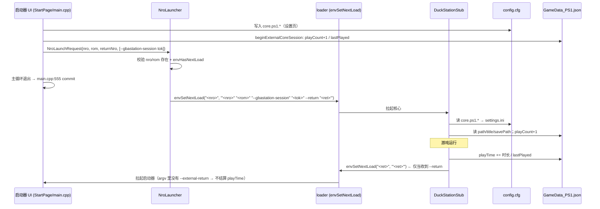
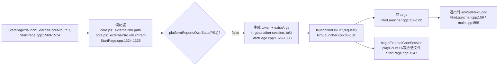
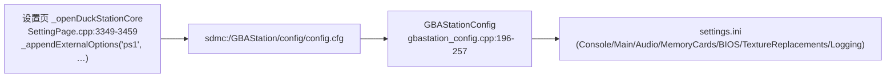

# PS1 参数链：GBAStation 启动器 ⇄ gsnx_duckstation（DuckStation）

范围：只梳理 **启动器（GBAStation）** 与 **PS1 核心（gsnx_duckstation，产物
`GBAStationDuckStationStub.nro`）** 之间的参数链。结论均回验过源码，附 `文件:行号`。

---

## 0. 全景（四条通道）

```
        启动器                                           PS1 核心
┌────────────────────────┐                    ┌──────────────────────────────┐
│ ① argv（envSetNextLoad）│ ──ROM+session+ret─► │ ParseCommandLineParameters   │
│ ② config.cfg           │ ──core.ps1.*─────► │ GBAStationConfig → settings  │
│ ③ GameData_PS1.json    │ ──savePath/stats─► │ GameDatabase（自记统计）      │
│ ④ 返回 argv            │ ◄──"sdmc:/switch/GBAStation.nro"── 退出前布防      │
└────────────────────────┘                    └──────────────────────────────┘
```



---

## 1. 通道①：启动 argv

### 1.1 前端怎么拼（三步）



### 1.2 实际 argv（应用内 vs 桌面图标）

| 场景 | 实际 argv | 证据 |
|---|---|---|
| 应用内（库内点游戏） | `"sdmc:/GBAStation/core/GBAStationDuckStationStub.nro" "<rom>" "--gbastation-session" "<tok>" --return "sdmc:/switch/GBAStation.nro"` | StartPage.cpp:1569-1574, 1324-1338；NroLauncher.cpp:114-122 |
| 应用内（直启 / 文件关联） | 同上（同一 `launchExternalCore`） | main.cpp:329-335, 258-286 |
| 桌面图标（转发器） | `"<core>" "<rom>" --return "sdmc:/switch/GBAStation.nro"`（**无 session**） | ForwarderInstaller.cpp:225-226, 248-252；ForwarderCore.cpp:947-978 |

### 1.3 核心怎么解析（`nogui_host.cpp`）

| argv | 解析行为 | 字段/效果 | 行号 |
|---|---|---|---|
| `argv[0]` | 存程序路径 | `switch_program_path`（供 FileSystem/help） | :1658 |
| `--return <path>` | 记录 | `s_switch_return_nro=path`；`s_switch_return_to_nro=true`；`s_switch_external_launch_requested=true` | :1383-1389 |
| `--exit-to-home` | 关闭返回 | `s_switch_return_to_nro=false`；外部启动标记=true | :1390-1395 |
| `--gbastation-session <tok>` | **消费后丢弃**（防 token 被当 ROM） | 仅置外部启动标记 | :1396-1403 |
| `--` | 其后全当 boot 文件名 | `no_more_args` | :1405-1408 |
| 其它 `-xxx` | **直接报错返回 false** | 进程 EXIT_FAILURE | :1410-1413 |
| 位置参数 | 依次拼成 boot `filename` | `autoboot->filename` | :1420-1422 |
| （Switch） | 有 boot 文件名时强制 fastboot | `override_fast_boot=true` | :1425-1427 |
| 收尾校验 | 有外部启动参数但没有 boot 文件名 → 报错 | EXIT_FAILURE | :1691-1701 |

> 注意：核心**不认识** `--resume`（双横线）与 `--external-return`；前端目前也不会发。
> `-resume`（单横线）是 DuckStation 自己的读档参数。

---

## 2. 通道②：config.cfg（设置页 → 核心）

前端写 `core.ps1.*`（兼容旧键 `ps1.*` 由核心侧处理），核心在初始化时映射到 settings.ini 段/键。



| 分组 | config.cfg 键（前端写） | 核心映射 | 行号 |
|---|---|---|---|
| 系统 | `region`、`enable8MBRAM`、`enableCheats`、`disableAllEnhancements` | Console.Region / Enable8MBRAM / EnableCheats；Main.DisableAllEnhancements | SettingPage.cpp:3356-3360；gbastation_config.cpp:196-199 |
| 性能 | `emulationSpeed`、`fastForwardSpeed`、`turboSpeed`、`syncToHostRefreshRate`、`runaheadFrameCount`、`rewindEnable`、`rewindFrequency`、`rewindSaveSlots` | Main.* | SettingPage.cpp:3361-3367；gbastation_config.cpp:203-211 |
| 音频 | `outputVolume`、`fastForwardVolume`、`outputMuted`、`backend`、`stretchMode`、`outputLatencyMS`、`bufferMS` | Audio.* | SettingPage.cpp:3368-3374；gbastation_config.cpp:214-220 |
| 存档 | `saveStateOnExit`、`createSaveStateBackups`、`loadDevicesFromSaveStates` | Main.* | SettingPage.cpp:3375-3377；gbastation_config.cpp:223-226 |
| 记忆卡 | `memoryCardDirectory`、`usePlaylistTitle`、`card1Type`、`card2Type`、`card1Path`、`card2Path` | MemoryCards.* | SettingPage.cpp:3382-3420；gbastation_config.cpp:230-235 |
| BIOS | `biosPathNTSCJ`、`biosPathNTSCU`、`biosPathPAL`、`ttyLogging`、`fastBoot` | BIOS.PathNTSCJ / PathNTSCU / PathPAL / TTYLogging / PatchFastBoot | SettingPage.cpp:3425-3448；gbastation_config.cpp:238-242 |
| 纹理替换 | `enableVRAMWriteReplacements`、`preloadTextures`、`dumpVRAMWrites`、`dumpVRAMWriteForceAlphaChannel` | TextureReplacements.* | SettingPage.cpp:3451-3455；gbastation_config.cpp:245-250 |
| 日志 | `logLevel`、`logToConsole`、`logToDebug`、`logToFile` | Logging.* | SettingPage.cpp:3456-3460；gbastation_config.cpp:254-257 |

**缺口**：启动器没有为 PS1 调用 `_appendExternalDisplaySettings("ps1", …)`（全仓无匹配），
核心侧也没有 `display_mode`/`displayMode`/`integerAspectRatio` 的读取点 →
**PS1 的画面模式/整数倍/自定义缩放/遮罩不经过参数链**（`core.ps1.*` 与 GameData 都没有）。

---

## 3. 通道③：GameData_PS1.json

| 项 | 值 | 证据 |
|---|---|---|
| 文件 | `sdmc:/GBAStation/data/GameData_PS1.json`（回退 `/GBAStation/data/…`） | duckstation switch_paths.h:14-15 |
| 启动器侧同一个文件 | `databasePath()` = `ROOT/PROGRAM_NAME/DATA_BASE_DIR`，`GameData_PS1.json` | 前端 constexpr.h:84-87, 65, 109 |
| 核心读取字段 | `path`（匹配）、`title`、`savePath` | gbastation_game_db.cpp:111-112 |
| 核心写入字段 | `playCount`（启动 +1）、`playTime`（停止 += 时长）、`lastPlayed` | gbastation_game_db.cpp:185-204, 206-234 |
| `savePath` 实际用途 | **只被日志打印**（`Log_InfoPrintf(... save_path ...)`），全仓没有用它决定存档/记忆卡位置 | gbastation_game_db.cpp:202（另无消费者） |

---

## 4. 通道④：返回 argv

```mermaid
flowchart TD
    A["RunMessageLoop 结束"] --> B["CancelAsyncOp / StopCPUThread / 释放窗口\nnogui_host.cpp:1711-1726"]
    B --> C{"exit_code == SUCCESS?"}
    C -- 否（boot_failed） --> X["不布防，进程 EXIT_FAILURE\n:1720-1722"]
    C -- 是 --> D{"s_switch_return_to_nro?"}
    D -- 否（默认 false，或收到 --exit-to-home） --> Y["不布防，正常退出 → HOME/hbmenu"]
    D -- 是（收到 --return） --> E{"envHasNextLoad()?"}
    E -- 否 --> Y
    E -- 是 --> F["envSetNextLoad(ret, QuoteSwitchArg(ret))\nnogui_host.cpp:252-267"]
    F -- 失败 --> Z["记错误 + 进程 EXIT_FAILURE\n:1726"]
    F -- 成功 --> G["loader 拉起 sdmc:/switch/GBAStation.nro"]
```

| 项 | 值 | 证据 |
|---|---|---|
| 布防时机 | **退出前**（RunMessageLoop 之后、释放窗口之后），非启动即布防 | nogui_host.cpp:1711-1726 |
| path | `s_switch_return_nro`（`--return` 的值；初值 `SwitchPaths::ReturnNro`） | :232, :1385；switch_paths.h:10 |
| argv | **只有** `"sdmc:/switch/GBAStation.nro"`（加引号的纯路径，不带任何参数） | :257-258 |
| 默认开关 | `s_switch_return_to_nro = false` → **没有 `--return` 就永不返回** | :232, :254 |
| 存在性检查 | 无（只查空串与 `envHasNextLoad()`） | :252-267 |
| session token | 不产生、不回传 | :1396-1403 |
| `argc == 1` | 显式关闭返回（独立启动） | :1684-1685 |
| 启动器侧识别 | 只认 `--external-return <token>` → **PS1 的返回不会被结算** | ExternalCoreSession.cpp:146-154；main.cpp:400-406 |

---

## 5. 与目标「启动只传 ROM、返回不带参数」的差距

| 环节 | 现状 | 与目标 | 结论 |
|---|---|---|---|
| 启动 argv | `"<core>" "<rom>" "--gbastation-session" "<tok>" --return "<ret>"` | 只应传 `<rom>` | ❌ 多传 3 项（前端 StartPage.cpp:1337-1338、NroLauncher.cpp:119-122） |
| 桌面图标 argv | `"<core>" "<rom>" --return "<ret>"` | 只应传 `<rom>` | ❌ 多传 `--return`（ForwarderInstaller.cpp:248-252） |
| 核心解析 | 依赖 `--return` 才置 `s_switch_return_to_nro=true` | 应无条件返回启动器 | ❌ ROM-only 会**永不返回**（nogui_host.cpp:232, :1383-1389） |
| 返回 argv | `"sdmc:/switch/GBAStation.nro"` | 不带参数 | ✅ 已符合 |
| session token | 前端发、核心丢弃 | 不该存在 | ❌ 通路无效：前端 `begin` 已 playCount+1，返回无 token → `finish` 永不执行、`external_core_session.json` 残留、playTime 丢失 |
| 统计 | 前端会话 + 核心自记（GameData_PS1） | 单一来源 | ⚠️ 双写：playCount 可能 +2（`platformReportsOwnStats` 未登记 PS1） |

```
去掉参数后的最小改动清单（PS1 相关）
 ┌ 前端 ────────────────────────────────────────────────┐
 │ StartPage.cpp:1337-1338 / main.cpp:271-272  删 session  │
 │ NroLauncher.cpp:119-122                     删 extra+ret│
 │ ForwarderInstaller.cpp:248-252              删 --return │
 │ constexpr/ExternalCoreSession               删或改为    │
 │   “下次启动读残留会话结算”                              │
 └───────────────────────────────────────────────────────┘
 ┌ 核心 ────────────────────────────────────────────────┐
 │ nogui_host.cpp:232  s_switch_return_to_nro 默认 true    │
 │ nogui_host.cpp:254  默认返回路径已是 GBAStation.nro ✓   │
 │ nogui_host.cpp:1396 删 --gbastation-session 分支（可选）│
 │ gbastation_game_db.cpp  已自记统计 ✓（前端应停建会话）  │
 └───────────────────────────────────────────────────────┘
```

---

## 6. 实机核对方法

| 想确认 | 看哪里 | 期望 |
|---|---|---|
| loader 收到的 argv | `sdmc:/GBAStation/debug/external_core_launch.log`（`launch pending … argv=…`） | 含 session/`--return` |
| 核心实际 argv | `sdmc:/GBAStation/duckstation/duckstation.log` 或 console 的 `Command Line:` 行 | `--return` 被识别、token 被忽略 |
| 是否布防返回 | duckstation.log 的 `Configured return to GBAStation NRO: …` | 存在=已布防 |
| 统计是否双写 | `GameData_PS1.json` 的 `playCount` 与 `sdmc:/GBAStation/config/external_core_session.json` | playCount 应只 +1；会话文件不应残留 |
| config 是否生效 | duckstation 的 `settings.ini`（`sdmc:/GBAStation/duckstation/settings.ini`） | `core.ps1.*` 已映射进对应段 |

---

## 7. 证据索引（关键行）

- 前端：`StartPage.cpp:1297-1355, 1569-1574`；`NroLauncher.cpp:93-131, 114-122, 159`；
  `main.cpp:258-286, 329-335, 400-406, 555`；`ForwarderInstaller.cpp:225-226, 248-252`；
  `ForwarderCore.cpp:947-978`；`ExternalCoreSession.cpp:22-25, 64-70, 79-154`；`constexpr.h:65, 84-87, 109`
- 核心：`nogui_host.cpp:232, 252-267, 1276-1427, 1684-1701, 1711-1726`；
  `gbastation_config.cpp:196-257`；`gbastation_game_db.cpp:111-112, 185-234`；`switch_paths.h:10-16`
