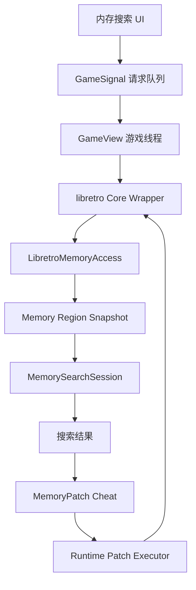

# libretro 内存搜索与修改执行方案

## 目标

为非 NDS 的 libretro 核心提供内存搜索、一次性修改、冻结修改和保存为金手指的能力。

melonDS 不参与该系统。NDS 金手指继续走 `usrcheat.dat` / AR Code / melonDS `AREngine` 流程，避免引入 ARM9/ARM7 地址空间和 melonDS 内部内存映射复杂度。

## 范围

### 支持

- libretro 核心：
  - mGBA
  - FCEUmm
  - Snes9x
  - 后续其他 libretro 核心
- 精确值搜索
- 二次筛选
- 一次性写入
- 冻结写入
- 搜索结果保存为项目自有金手指条目

### 暂不支持

- melonDS 内存搜索
- melonDS 内存修改
- NDS 搜索结果保存为内存 patch
- 浮点搜索
- 复杂表达式搜索
- 跨平台统一裸地址格式
- 第一阶段不强依赖 RetroArch `.cht` frontend memory patch 兼容

## 总体架构



核心原则：

- UI 不直接读写核心内存。
- 搜索使用快照，不长期持有核心内存指针。
- 写入和冻结统一在游戏线程安全点执行。
- 内部地址使用 `regionId + offset`，不要只保存裸地址。

## 模块设计

### 1. libretro 内存访问层

建议新增：

- `src/core/memory/MemoryTypes.hpp`
- `src/core/memory/LibretroMemoryAccess.hpp`
- `src/core/memory/LibretroMemoryAccess.cpp`

核心结构：

```cpp
struct LibretroMemoryRegion
{
    std::string id;
    std::string name;
    unsigned retroMemoryId = 0;
    uint8_t* data = nullptr;
    size_t size = 0;
    bool writable = true;
};
```

第一阶段只枚举稳定区域：

- `RETRO_MEMORY_SYSTEM_RAM`
- `RETRO_MEMORY_SAVE_RAM`
- `RETRO_MEMORY_RTC`

默认搜索区域只启用 `SYSTEM_RAM`。`SAVE_RAM` 和 `RTC` 可以显示为高级选项，避免用户误改存档或时钟数据。

需要在 `LibretroLoader` 增加：

```cpp
std::vector<LibretroMemoryRegion> getMemoryRegions();
bool readMemory(const std::string& regionId, uint64_t offset, void* out, size_t size);
bool writeMemory(const std::string& regionId, uint64_t offset, const void* data, size_t size);
```

### 2. 搜索会话

建议新增：

- `src/core/memory/MemorySearchSession.hpp`
- `src/core/memory/MemorySearchSession.cpp`

基础枚举：

```cpp
enum class SearchValueType
{
    U8,
    U16,
    U32,
    S8,
    S16,
    S32,
};

enum class SearchCompareMode
{
    Equal,
    NotEqual,
    Greater,
    Less,
    Increased,
    Decreased,
    Changed,
    Unchanged,
};
```

结果结构：

```cpp
struct MemorySearchResult
{
    std::string regionId;
    uint64_t offset = 0;
    SearchValueType valueType = SearchValueType::U8;
    std::vector<uint8_t> previousValue;
    std::vector<uint8_t> currentValue;
};
```

搜索流程：

1. 游戏线程复制目标 region 快照。
2. 首次精确搜索生成候选结果。
3. 二次搜索时复制新快照，与上一次候选地址比较。
4. 更新候选结果和上一轮快照值。

性能约束：

- 搜索结果数量设置上限，例如 100000。
- UI 展示分页或虚拟列表。
- 搜索时不要阻塞 UI 线程。
- 第一版可以在游戏线程同步执行，后续如卡顿明显，再改为快照复制在游戏线程、搜索计算在后台线程。

### 3. 写入与冻结

一次性写入：

- UI 发写入请求。
- 游戏线程消费请求。
- 调用 `writeMemory(regionId, offset, value)`。

冻结写入：

- 保存为 runtime memory patch。
- 每帧在安全点重复写入。

执行位置建议：

```cpp
ApplyRuntimeMemoryPatches();
RunFrame();
```

第一版只在 `RunFrame()` 前写。若后续发现部分游戏会在同一帧覆盖数值，再增加 `RunFrame()` 后二次写入选项。

### 4. 与金手指系统衔接

在 `CheatPayloadType` 中使用或新增：

```cpp
MemoryPatch
```

内存 patch 条目需要表达：

```cpp
struct MemoryPatchPayload
{
    std::string regionId;
    uint64_t offset = 0;
    SearchValueType valueType = SearchValueType::U8;
    std::vector<uint8_t> value;
    bool freeze = true;
    bool littleEndian = true;
};
```

执行规则：

- libretro 核心支持 `MemoryPatch`。
- melonDS 遇到 `MemoryPatch` 直接忽略，并可在 UI 显示“不支持当前核心”。
- `.cht` 原始金手指仍走 `retro_cheat_set()`。
- 内存搜索保存的条目走项目自有格式，不强行保存为 RetroArch `.cht`。

### 5. 持久化格式

建议新增项目自有金手指文件，例如 `.blcheat.json`。

示例：

```json
{
  "version": 1,
  "platform": "GBA",
  "core": "mgba",
  "entries": [
    {
      "name": "Money 999999",
      "enabled": true,
      "payloadType": "memory_patch",
      "region": "system_ram",
      "offset": 123456,
      "valueType": "u32",
      "value": "3F420F00",
      "endian": "little",
      "freeze": true
    }
  ]
}
```

保存原则：

- `region + offset` 是主保存格式。
- 裸地址只用于 UI 显示。
- 文件中记录 platform/core，方便后续判断是否可用。

## UI 设计

第一版 UI 最小闭环：

- 内存区域选择
- 数据类型选择：8/16/32 位，有符号/无符号
- 数值输入
- 首次搜索
- 再次搜索
- 搜索结果列表
- 修改当前地址
- 冻结当前地址
- 保存为金手指

结果列表字段：

- 显示地址：`regionId + offset`
- 当前值
- 上一次值
- 数据类型
- 操作按钮：修改、冻结、保存

交互建议：

- 搜索结果超过上限时提示用户继续筛选。
- 修改和冻结成功后给轻提示。
- 当前平台为 melonDS/NDS 时隐藏入口或显示“不支持 NDS 内存搜索”。

## GameSignal 请求设计

建议新增队列式请求，避免连续操作丢失：

```cpp
struct MemorySearchRequest
{
    int sessionId = 0;
    std::string regionId;
    SearchValueType valueType;
    SearchCompareMode compareMode;
    std::vector<uint8_t> value;
};

struct MemoryWriteRequest
{
    std::string regionId;
    uint64_t offset = 0;
    SearchValueType valueType;
    std::vector<uint8_t> value;
};
```

原则：

- 请求队列由 UI 写入。
- 游戏线程消费。
- 搜索结果通过线程安全结果缓存返回 UI。
- 不使用单 pending 槽位，避免用户连续操作丢请求。

## 实施阶段

### 阶段 1：基础内存访问

- 增加 libretro memory region 枚举。
- 增加 `readMemory` / `writeMemory`。
- 在 mGBA、FCEUmm、Snes9x 上验证 `SYSTEM_RAM` 可读写。
- melonDS 返回空 region 或不暴露入口。

验收：

- 能显示当前核心可搜索内存区域。
- 能读取 `SYSTEM_RAM` 快照。
- 能对指定 offset 写入测试值。

### 阶段 2：精确值搜索

- 实现 `MemorySearchSession`。
- 支持 U8/U16/U32/S8/S16/S32 精确搜索。
- 支持二次精确筛选。
- UI 显示结果列表。

验收：

- GBA/NES/SNES 游戏可搜索数值。
- 二次搜索能缩小结果。
- 大结果集不会卡死 UI。

### 阶段 3：一次性修改

- UI 支持对搜索结果写入新值。
- 写入请求进入游戏线程执行。
- 修改后刷新当前结果值。

验收：

- 修改生命、金币等简单数值能即时生效。
- 无效 region/offset 不崩溃，有提示或日志。

### 阶段 4：冻结与 runtime patch

- 增加 runtime memory patch 列表。
- 每帧 `RunFrame()` 前执行冻结写入。
- UI 支持冻结开关。

验收：

- 被冻结的数值在游戏内变化后会恢复。
- 关闭冻结后游戏可正常修改该值。

### 阶段 5：保存为金手指

- 增加 `.blcheat.json` 读写。
- 搜索结果可保存为 `MemoryPatch`。
- 游戏启动加载后自动应用启用的 patch。

验收：

- 保存后重启游戏仍能加载。
- libretro memory patch 和原 `.cht` raw cheat 可共存。
- NDS/melonDS 不加载或忽略 memory patch。

### 阶段 6：增强搜索

- 增加未知初始值。
- 增加变大、变小、变化、不变。
- 增加范围搜索。
- 视情况支持 float。

验收：

- 不知道初始值时也能逐步筛出地址。
- 搜索过程内存占用可控。

## 风险与注意事项

- 不同 libretro 核心的 `SYSTEM_RAM` 语义可能不同，需要按平台校验。
- 有些核心不会暴露完整内存映射，第一版不要承诺全地址空间搜索。
- 保存 `region + offset` 比裸地址稳定，但核心版本变化仍可能导致失效。
- 冻结写入过多会影响帧率，需要限制数量或批量优化。
- 修改存档区可能破坏存档，默认不要搜索 `SAVE_RAM`。
- UI 连续操作必须使用队列，不要再使用单 pending 请求。

## 推荐落地顺序

1. 先做 `SYSTEM_RAM` 精确搜索。
2. 再做一次性写入。
3. 再做冻结。
4. 最后做保存为项目自有金手指。

这样可以最快形成可用闭环，也能避免一开始被 RetroArch `.cht` 兼容和复杂 memory map 拖慢。
