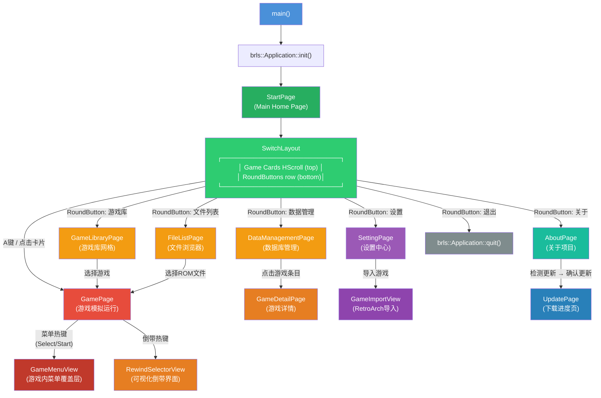

# BeikLiveStation (GBAStation) 程序界面流程图

> 基于 `src/` 下全部代码 + `report/borealis_ui_api_full.md` 分析绘制

---

## 一、全局架构

```
┌─────────────────────────────────────────────────────────────────────────────────┐
│                           brls::Application                                      │
│  Activity Stack: [MyActivity] → [GamePage Activity] → [SettingPage Activity] ... │
│  全局服务: Theme/Style, ImeManager, ControllerState, AudioPlayer, NVGcontext     │
└─────────────────────────────────────────────────────────────────────────────────┘
                                      │
                                      ▼
┌─────────────────────────────────────────────────────────────────────────────────┐
│                          beiklive::Box (基类容器)                                │
│  ┌───────────────────────────────────────────────────────────────────────────┐  │
│  │  backgroundLayer (brls::Image)     ← 静态背景图，默认 img/bg2.png         │  │
│  │  shaderLayer (DynamicBackgroundBox) ← 动态渐变背景（Midnight/Lemon…等7种） │  │
│  │  mainBox (COLUMN)                  ← 主布局容器                           │  │
│  │    ├── header  (HeaderBar)         ← 标题栏 / 路径 / 信息行               │  │
│  │    ├── contentBox (grow=1)         ← 内容区（所有子页面添加至此）          │  │
│  │    └── bottomBar (BottomBar)       ← 底部按键提示栏                       │  │
│  └───────────────────────────────────────────────────────────────────────────┘  │
└─────────────────────────────────────────────────────────────────────────────────┘
```

---

## 二、完整页面导航流程图



---

## 三、各页面详细布局

### 3.1 StartPage — 起始页 (主界面)

```
┌──────────────────────────────────────────────────────────────────┐
│  [背景层] backgroundLayer / shaderLayer                          │
│  ┌──────────────────────────────────────────────────────────────┐│
│  │ HeaderBar: "BeikLiveStation"            path / info          ││
│  ├──────────────────────────────────────────────────────────────┤│
│  │                                                              ││
│  │  ┌── SwitchLayout (COLUMN) ────────────────────────────┐    ││
│  │  │                                                      │    ││
│  │  │  [Game Card Row - HScrollingFrame (CENTERED)]        │    ││
│  │  │  ┌─────┐  ┌─────┐  ┌─────┐  ┌─────┐  ┌─────┐      │    ││
│  │  │  │Card0│  │Card1│  │Card2│  │Card3│  │ ... │      │    ││
│  │  │  │Logo │  │Logo │  │Logo │  │Logo │  │     │      │    ││
│  │  │  │Title│  │Title│  │Title│  │Title│  │     │      │    ││
│  │  │  │Time │  │Time │  │Time │  │Time │  │     │      │    ││
│  │  │  └─────┘  └─────┘  └─────┘  └─────┘  └─────┘      │    ││
│  │  │                                                      │    ││
│  │  │  [Function Area (ROW) - RoundButtons]                │    ││
│  │  │  ┌────┐ ┌────┐ ┌────┐ ┌────┐ ┌────┐ ┌────┐        │    ││
│  │  │  │游戏│ │文件│ │数据│ │设置│ │关于│ │退出│        │    ││
│  │  │  │ 库 │ │列表│ │管理│ │    │ │    │ │    │        │    ││
│  │  │  └────┘ └────┘ └────┘ └────┘ └────┘ └────┘        │    ││
│  │  │                                                      │    ││
│  │  └──────────────────────────────────────────────────────┘    ││
│  │                                                              ││
│  ├──────────────────────────────────────────────────────────────┤│
│  │ BottomBar: [A:打开] [X:游戏选项] ...                         ││
│  └──────────────────────────────────────────────────────────────┘│
└──────────────────────────────────────────────────────────────────┘
```

**GameCard 结构:**
- 封面图 (`Image`, FIT缩放)
- 平台Logo叠加层 (`Image`)
- 游戏标题 (`Label`, 获焦时滚动)
- 游玩时间 / 最后游玩 (`Label`, 获焦时滑入)
- 入场/点击/收藏动画
- 按键: A=打开游戏, X=游戏选项(侧边栏), ☆=收藏切换

**GameOptionsSidebar (X键弹出):**
- 半透明遮罩 + 右侧面板
- 修改映射名称 → IME输入
- 设置封面图 → 文件选择器
- 删除游戏 → 确认对话框

---

### 3.2 GameLibraryPage — 游戏库

```
┌──────────────────────────────────────────────────────────────────┐
│  HeaderBar: "游戏库"             分类:GBA  共XX款游戏            │
├──────────────────────────────────────────────────────────────────┤
│                                                                  │
│  ┌── RecyclingGrid (3列, 分页加载) ──────────────────────────┐  │
│  │  ┌─────────┐ ┌─────────┐ ┌─────────┐                      │  │
│  │  │ GridItem│ │ GridItem│ │ GridItem│                      │  │
│  │  │ ┌─────┐ │ │ ┌─────┐ │ │ ┌─────┐ │                      │  │
│  │  │ │封面  │ │ │ │封面  │ │ │ │封面  │ │                      │  │
│  │  │ │     │ │ │ │     │ │ │ │     │ │                      │  │
│  │  │ └─────┘ │ │ └─────┘ │ │ └─────┘ │                      │  │
│  │  │ 标题    │ │  标题    │ │  标题    │                      │  │
│  │  │ 次行    │ │  次行    │ │  次行    │                      │  │
│  │  │ 时长    │ │  时长    │ │  时长    │                      │  │
│  │  └─────────┘ └─────────┘ └─────────┘                      │  │
│  │         ...  (分页加载, 每页21项)                           │  │
│  └──────────────────────────────────────────────────────────────┘  │
│                                                                  │
├──────────────────────────────────────────────────────────────────┤
│  BottomBar: [A:打开] [Y:分类] [X:设置] [RT:搜索] [B:返回]       │
└──────────────────────────────────────────────────────────────────┘
```

功能:
- Y键 → Dropdown选择平台过滤 (ALL/GBA/GBC/GB)
- RT键 → IME文本搜索
- X键 → GameOptionsSidebar (同StartPage)
- 滚动到底部自动加载下一页

---

### 3.3 FileListPage — 文件浏览器

```
┌──────────────────────────────────────────────────────────────────┐
│  HeaderBar: "文件浏览"           path  当前index/总数             │
├──────────────────────────────────────────────────────────────────┤
│  ┌── mainRow (ROW) ──────────────────────────────────────────┐  │
│  │                                                            │  │
│  │  ┌─ leftPanel (grow=1) ─┐   ┌─ detailPanel (30%) ──────┐ │  │
│  │  │ ┌─ listCard ───────┐ │   │ ┌─ detailCard ─────────┐ │ │  │
│  │  │ │ FileListView     │ │   │ │ ┌──────────────────┐ │ │ │  │
│  │  │ │ ┌──────────────┐ │ │   │ │ │ 缩略图 (160x160)│ │ │ │  │
│  │  │ │ │ [D] folder1  │ │ │   │ │ └──────────────────┘ │ │ │  │
│  │  │ │ │ [D] folder2  │ │ │   │ │ 标题 (滚动)          │ │ │  │
│  │  │ │ │ [F] game.gba │ │ │   │ │ 副标题               │ │ │  │
│  │  │ │ │ [F] game.gbc │ │ │   │ │ ═══════════════════ │ │ │  │
│  │  │ │ │ [F] image.png│ │ │   │ │ [GBA] 游戏时长 XX   │ │ │  │
│  │  │ │ │ ...          │ │ │   │ │ 容量  8.5 MB        │ │ │  │
│  │  │ │ └──────────────┘ │ │   │ │ 最后游玩 2天前      │ │ │  │
│  │  │ └─────────────────┘ │   │ │ 打开次数 12          │ │ │  │
│  │  └─────────────────────┘   │ │ 路径  /roms/xxx.gba  │ │ │  │
│  │                            │ └──────────────────────┘ │ │  │
│  └────────────────────────────┴──────────────────────────┘ │  │
├──────────────────────────────────────────────────────────────┤  │
│  BottomBar: [A:打开] [X:设置映射名] [B:返回上级] [RB:面板]  │  │
└──────────────────────────────────────────────────────────────┘
```

详情面板按文件类型显示不同内容:
- **游戏文件(有DB)**: 封面图 + GBA/GBC/GB徽章 + 时长 + 容量 + 最后游玩 + 打开次数 + 路径
- **游戏文件(无DB)**: 平台图标 + 扩展名徽章 + 容量 + 路径
- **图片文件**: 缩略图预览 + 容量 + 路径
- **文件夹**: 文件夹图标 + N个项目
- **其他文件**: 通用图标 + 扩展名 + 容量 + 路径

---

### 3.4 GamePage — 游戏运行页面

```
┌──────────────────────────────────────────────────────────────────┐
│  GamePage (COLUMN, CENTER)                                       │
│                                                                  │
│  ┌── GameView (ABSOLUTE, 100%x100%, Focusable) ──────────────┐  │
│  │                                                              │  │
│  │     [游戏画面渲染区域 - OpenGL纹理]                           │  │
│  │     - ScreenMode: Fit/Fill/Original/Integer/Custom          │  │
│  │     - Filter: Nearest/Linear                                 │  │
│  │     - Overlay: 遮罩图层                                      │  │
│  │     - Shader: GLSLP着色器                                     │  │
│  │                                                              │  │
│  │     [状态覆盖层 - Overlay]                                   │  │
│  │     - FPS显示 (右上)                                         │  │
│  │     - 快进指示 (>> 4x)                                       │  │
│  │     - 倒带指示 (<<)                                          │  │
│  │     - 静音图标                                                │  │
│  │                                                              │  │
│  └──────────────────────────────────────────────────────────────┘  │
│                                                                  │
│  ┌── GameMenuView (ABSOLUTE, 100%x100%, GONE) ────────────────┐  │
│  │  [半透明黑色背景]                                             │  │
│  │  ┌── TabFrame ────────────────────────────────────────────┐ │  │
│  │  │ ┌──────────────┐  ┌──────────────────────────────────┐ │ │  │
│  │  │ │ Tab Buttons   │  │ Content Panel                    │ │ │  │
│  │  │ │              │  │                                   │ │ │  │
│  │  │ │ ■ 即时存档   │  │ [SaveGrid: 10个槽位 GridBox]      │ │ │  │
│  │  │ │ ■ 即时读档   │  │ ┌────┐┌────┐┌────┐┌────┐┌────┐  │ │ │  │
│  │  │ │ ■ 金手指     │  │ │槽0 ││槽1 ││槽2 ││槽3 ││槽4 │  │ │ │  │
│  │  │ │ ■ 显示设置   │  │ │    ││    ││    ││    ││    │  │ │ │  │
│  │  │ │              │  │ └────┘└────┘└────┘└────┘└────┘  │ │ │  │
│  │  │ │              │  │ ┌────┐┌────┐┌────┐┌────┐┌────┐  │ │ │  │
│  │  │ │              │  │ │槽5 ││槽6 ││槽7 ││槽8 ││槽9 │  │ │ │  │
│  │  │ │              │  │ │    ││    ││    ││    ││    │  │ │ │  │
│  │  │ │              │  │ └────┘└────┘└────┘└────┘└────┘  │ │ │  │
│  │  │ │              │  │                                   │ │ │  │
│  │  │ │              │  │ [CheatPanel: 金手指开关列表]       │ │ │  │
│  │  │ │              │  │ [DisplayPanel: 画面模式/滤镜等]    │ │ │  │
│  │  │ │              │  │                                   │ │ │  │
│  │  └─┴──────────────┴──┴───────────────────────────────────┘ │ │  │
│  │                                                              │  │
│  │  [底部功能按钮]                                              │  │
│  │  ┌─────────┐ ┌─────────┐ ┌─────────┐ ┌──────────┐         │  │
│  │  │ 返回游戏 │ │ 重置游戏 │ │ 退出游戏 │ │[Tab切换] │         │  │
│  │  └─────────┘ └─────────┘ └─────────┘ └──────────┘         │  │
│  └──────────────────────────────────────────────────────────────┘  │
│                                                                  │
│  ┌── RewindSelectorView (ABSOLUTE, 100%x100%, GONE) ──────────┐  │
│  │  [半透明黑色背景 + 底部面板]                                  │  │
│  │  "可视化倒带"                                                │  │
│  │  ┌── HScrollingFrame ────────────────────────────────────┐ │  │
│  │  │ ┌──────┐ ┌──────┐ ┌──────┐ ┌──────┐ ┌──────┐       │ │  │
│  │  │ │-120s │ │-100s │ │ -80s │ │ -60s │ │ -40s │ ...   │ │  │
│  │  │ │[img] │ │[img] │ │[img] │ │[img] │ │[img] │       │ │  │
│  │  │ └──────┘ └──────┘ └──────┘ └──────┘ └──────┘       │ │  │
│  │  └──────────────────────────────────────────────────────┘ │  │
│  │  [A:恢复此帧] [B:取消]                                      │  │
│  └──────────────────────────────────────────────────────────────┘  │
└──────────────────────────────────────────────────────────────────┘
```

**GameView — 游戏运行核心:**
- 独立游戏线程: 运行 mGBA核心 → 捕获视频帧 → 上传GPU纹理 → draw()
- 输入处理: `GameInputManager` 管理手柄/键盘映射
- 倒带系统: 每N帧保存状态到缓冲区 (deque)，支持可视化选择
- 即时存档: 10个槽位，文件序列化 + 缩略图截图
- 快进: 支持0.1x~8x倍速，带静音选项
- Turbo连发: A/B键连发支持
- SRAM自动落盘: CRC检测 + 延迟写盘
- 游玩时长统计: 启动计时 → 定时写入临时文件 → 退出时合并到GameDB

**GameMenuView 菜单标签页:**
- **即时存档**: GridBox 10槽位，显示缩略图+时间，A=存档, X=删除
- **即时读档**: GridBox 10槽位，显示缩略图+时间，A=读档
- **金手指**: 选择cht文件 → 解析条目 → 开关列表( SwitchButton )
- **显示设置**: 画面模式/整数倍缩放/自定义缩放/纹理过滤/着色器开关路径/遮罩开关路径/着色器参数调整

---

### 3.5 SettingPage — 设置中心

```
┌──────────────────────────────────────────────────────────────────┐
│  HeaderBar: "设置"                  path / info                   │
├──────────────────────────────────────────────────────────────────┤
│  ┌── TabFrame ────────────────────────────────────────────────┐  │
│  │ ┌─────────────┐ ┌────────────────────────────────────────┐ │  │
│  │ │ Tab Buttons  │ │ ScrollingFrame Content                 │ │  │
│  │ │              │ │                                        │ │  │
│  │ │ ■ 模拟器设置 │ │ GBA/GBC 核心设置                       │ │  │
│  │ │              │ │   - GB机型选择 (Autodetect/GB/SGB...)  │ │  │
│  │ │ ■ 游戏设置   │ │   - 使用BIOS开关                       │ │  │
│  │ │              │ │   - 跳过BIOS动画开关                   │ │  │
│  │ │ ■ 显示设置   │ │   - GB配色 (Grayscale/GB Pocket/...)   │ │  │
│  │ │              │ │ 存档设置                                │ │  │
│  │ │ ■ 声音设置   │ │   - SRAM存档目录                       │ │  │
│  │ │              │ │   - 自动保存状态 (0-9槽位)             │ │  │
│  │ │ ■ 按键设置   │ │   - 自动保存间隔 (1/3/5/10分钟)       │ │  │
│  │ │              │ │   - 启动自动加载                        │ │  │
│  │ │ ■ 调试设置   │ │ 封面设置                                │ │  │
│  │ │              │ │   - 使用存档截图作为封面                │ │  │
│  │ │              │ │ 动态背景                                │ │  │
│  │ │              │ │   - 启用动态渐变背景                    │ │  │
│  │ │              │ │   - 渐变主题 (深夜蓝/柠檬黄/...)       │ │  │
│  │ │              │ │ 背景图片                                │ │  │
│  │ │              │ │   - 启用背景图片                        │ │  │
│  │ │              │ │   - 背景图片路径 (文件选择器)           │ │  │
│  │ │              │ │ 导入游戏                                │ │  │
│  │ │              │ │   - 导入游戏库 → GameImportView        │ │  │
│  │ │              │ │                                        │ │  │
│  │ │              │ │ [游戏设置]                              │ │  │
│  │ │              │ │   - 快进设置 (启用/模式/倍率/静音)     │ │  │
│  │ │              │ │   - 倒带设置 (启用/模式/静音/步进/     │ │  │
│  │ │              │ │     可视化UI/保存间隔/缓冲大小/压缩)   │ │  │
│  │ │              │ │                                        │ │  │
│  │ │              │ │ [显示设置]                              │ │  │
│  │ │              │ │   - 画面模式 (Fit/Fill/Original/...)   │ │  │
│  │ │              │ │   - 整数倍缩放 (1x~5x)                 │ │  │
│  │ │              │ │   - 纹理过滤 (Nearest/Linear)          │ │  │
│  │ │              │ │   - 覆盖层开关 (快进/倒带/静音/FPS)   │ │  │
│  │ │              │ │   - 遮罩设置 (启用 + GBA/GBC/GB路径)  │ │  │
│  │ │              │ │   - 着色器设置 (启用 + GBA/GBC/GB路径) │ │  │
│  │ │              │ │                                        │ │  │
│  │ │              │ │ [声音设置]                              │ │  │
│  │ │              │ │   - 主音量滑块                          │ │  │
│  │ │              │ │   - 静音开关                            │ │  │
│  │ │              │ │   - 重采样质量 (Normal/Medium/High)    │ │  │
│  │ │              │ │                                        │ │  │
│  │ │              │ │ [按键设置]                              │ │  │
│  │ │              │ │   - 16个手柄按键 + 键盘组合键绑定      │ │  │
│  │ │              │ │   - 点击 → KeyCaptureView全屏捕获      │ │  │
│  │ │              │ │   - Turbo A/B连发开关                  │ │  │
│  │ │              │ │                                        │ │  │
│  │ │              │ │ [调试设置]                              │ │  │
│  │ │              │ │   - 日志级别 (debug/warning/error)     │ │  │
│  │ │              │ │   - 日志文件开关                        │ │  │
│  │ │              │ │   - 调试覆盖层开关                      │ │  │
│  │ └─┴─────────────┴──┴─────────────────────────────────────┘ │  │
│  └──────────────────────────────────────────────────────────────┘  │
├──────────────────────────────────────────────────────────────────┤
│  BottomBar: [A:选择] [B:返回] ...                                 │
└──────────────────────────────────────────────────────────────────┘
```

---

### 3.6 AboutPage — 关于页面

```
┌── TabFrame ───────────────────────────────────────────────────┐
│                                                                │
│ Tab1: "关于本项目"                                             │
│   - 作者卡片: 头像 + GitHub链接 + BiliBili链接                 │
│   - 项目说明: 功能特性列表                                     │
│                                                                │
│ Tab2: "更新"                                                   │
│   - 当前版本信息 (version.json)                                │
│   - 检测更新按钮 → AppUpdater → UpdateDialog                   │
│     └→ 确认 → UpdatePage (下载进度)                            │
│   - 更新日志 (ScrollingFrame, v0.1.0 ~ v0.1.8)                │
│                                                                │
│ Tab3: "支持作者"                                               │
│   - 文字说明                                                   │
│   - QQ群二维码图片                                             │
│   - 赞赏码图片                                                 │
│                                                                │
└────────────────────────────────────────────────────────────────┘
```

---

### 3.7 其他页面摘要

| 页面 | 布局 | 功能 |
|------|------|------|
| **DataManagementPage** | GridBox(6列) + GameGridItem | 展示所有数据库游戏，点击进入GameDetailPage |
| **GameDetailPage** | 左菜单(ButtonBox) + 右面板 | 存档管理(删除)、金手指管理(查看/删除/改名)、成就(占位) |
| **UpdatePage** | 居中卡片 | 下载进度条 + 速度/大小/预计时间 + 取消按钮 |
| **GameImportView** | 按钮界面 → 进度界面 | 选择RetroArch播放列表(.lpl) → 批量导入到数据库 |
| **UpdateDialog** | beiklive::Box 弹窗 | 版本更新公告 + 更新/取消/不再提示 按钮 |

---

## 四、核心组件关系

### 4.1 Box 层叠结构

```
beiklive::Box (每页基类)
 ├── backgroundLayer (Image, ABSOLUTE, 100%)    ← 最底层
 ├── shaderLayer (DynamicBackgroundBox, ABSOLUTE, 100%) ← 渐变层
 └── mainBox (COLUMN, 100%)
     ├── header (HeaderBar)
     │    ├── m_titleLabel  ← "设置/游戏库/..."
     │    ├── m_pathLabel   ← "分类: GBA" 或路径
     │    └── m_infoLabel   ← "共XX款游戏" 或 "1/10"
     ├── contentBox (grow=1) ← 各页面在此添加子视图
     └── bottomBar (BottomBar) ← 按键提示
```

### 4.2 TabFrame (自定义标签页组件)

```
beiklive::TabFrame
 ├── m_tabBar (ROW, 左侧)      ← 标签按钮列表 (ButtonBox)
 └── m_contentArea (grow=1)    ← 右侧内容区
      ├── Tab0 content
      ├── Tab1 content (GONE)
      └── Tab2 content (GONE)

使用页面: SettingPage, AboutPage, GameMenuView
```

### 4.3 GridBox vs RecyclingGrid

| 组件 | 用途 | 特性 |
|------|------|------|
| `GridBox` | 固定项目数的网格 | 简单遍历，DataManagementPage(数据管理)、GameMenuView(存档槽位) |
| `RecyclingGrid` | 大量项目的网格 | 视图复用，分页加载，GameLibraryPage(游戏库) |

---

## 五、按键与输入系统

```
┌─────────────────────────────────────────────────────────────┐
│                    输入处理流程                               │
│                                                             │
│  ControllerState ──→ Application::mainLoop()                │
│       │                   │                                 │
│       │                   ▼                                 │
│       │          FocusedView::handleInput()                  │
│       │                   │                                 │
│       │          ┌────────┼────────┐                        │
│       │          ▼        ▼        ▼                        │
│       │     registerAction  Gesture  Navigation             │
│       │                                                      │
│  GamePage (特殊)                                             │
│    GameView获得焦点 → _registerGameInput()                   │
│    → 遍历所有手柄按键 → 直接读取 ControllerState             │
│    → 映射到 RetroPad 虚拟按键 → 注入 libretro 核心           │
│                                                             │
│    KeyCaptureView (按键捕获)                                 │
│    → 消费所有导航键 → 捕获手柄/键盘/摇杆输入                 │
│    → 组合键格式化 ("PAD_A + PAD_B") → 写入配置文件          │
└─────────────────────────────────────────────────────────────┘
```

---

## 六、导航关系总结

```
                          main()
                            │
                     StartPage (Activity #0)
                      │         │
          ┌───────────┼─────────┼───────────┬───────────┐
          ▼           ▼         ▼           ▼           ▼
   GameLibraryPage  FileListPage  DataMgmt  Setting   About
       pushAct         pushAct      pushAct  pushAct   pushAct
          │               │           │
          ▼               ▼           ▼
       GamePage ◄─────────┘     GameDetailPage
       pushAct
          │
    ┌─────┴─────┐
    ▼           ▼
 GameMenuView  RewindSelectorView
 (同一Activity, (同一Activity,
  GONE/GONE)    GONE/GONE)

所有 pushActivity 使用 brls::TransitionAnimation::NONE (无转场动画)
返回上一页面使用 brls::Application::popActivity() 或 BUTTON_B
```

## 七、数据流向

```
┌──────────────┐    ┌──────────────┐    ┌──────────────┐
│  ConfigMgr   │    │   GameDB     │    │  NameMapping │
│ (setting.json│    │ (game_db.json│    │  (mapping.   │
│  键值存储)   │    │  JSON数据库) │    │   json)      │
└──────┬───────┘    └──────┬───────┘    └──────┬───────┘
       │ GET/SET_KEY_xxx   │  findByPath()     │ GET_MAPPING_KEY
       │                   │  getAll()         │ Set()
       │                   │  upsertByPath()   │
       ▼                   ▼                   ▼
┌─────────────────────────────────────────────────────┐
│                    UI Pages                          │
│                                                     │
│  SettingPage ◄── 读写配置 ──► ConfigMgr             │
│  StartPage ◄── 最近游玩 ──► GameDB                 │
│  GameLibraryPage ◄── 全部游戏 ──► GameDB            │
│  FileListPage ◄── 映射名 ──► NameMapping            │
│  GamePage ◄── 读写entry ──► GameDB                  │
│  DataManagementPage ◄── 全部游戏 ──► GameDB         │
│  GameDetailPage ◄── 游戏详情 ──► GameDB             │
│  GameImportView ──► 批量写入 ──► GameDB            │
└─────────────────────────────────────────────────────┘
```
